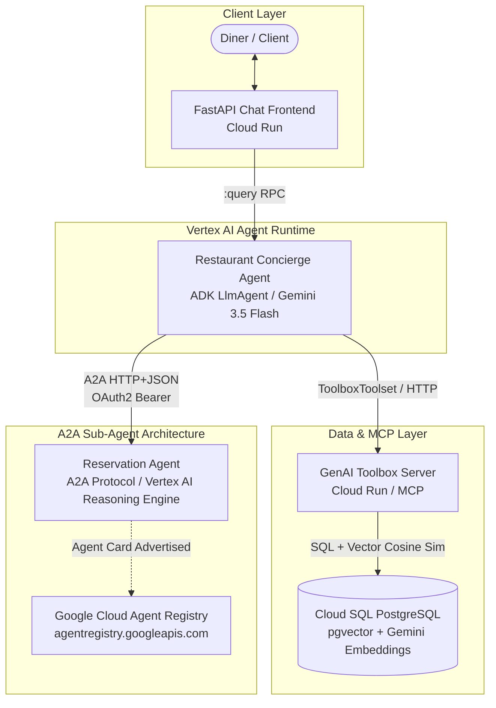

> **Disclaimer:** This README was autogenerated by Gemini.

# Foodie Finds — End-to-End Enterprise Restaurant Multi-Agent System

An end-to-end multi-agent AI solution built on **Google Cloud Platform (GCP)**, **Vertex AI**, and the **Agent Development Kit (ADK)**. 

The system powers **"Foodie Finds,"** a smart restaurant concierge service featuring natural language menu search (semantic similarity search powered by `pgvector` and Gemini embeddings), item detail retrieval, dynamic menu updates, table reservation management via the **Agent-to-Agent (A2A)** protocol, and automated registration in **Google Cloud Agent Registry**.

---

## 📑 Table of Contents

- [Architecture Overview](#architecture-overview)
- [Key Features](#key-features)
- [Repository Structure](#repository-structure)
- [Components Deep Dive](#components-deep-dive)
  - [1. Restaurant Concierge Agent (`restaurant_agent`)](#1-restaurant-concierge-agent-restaurant_agent)
  - [2. Reservation Agent (`reservation_agent`)](#2-reservation-agent-reservation_agent)
  - [3. GenAI Toolbox MCP Server (`deploy-toolbox`)](#3-genai-toolbox-mcp-server-deploy-toolbox)
  - [4. Cloud SQL & pgvector Database](#4-cloud-sql--pgvector-database)
  - [5. Chat Frontend UI (`frontend`)](#5-chat-frontend-ui-frontend)
  - [6. Infrastructure as Code & CI/CD](#6-infrastructure-as-code--cicd)
- [Agent-to-Agent (A2A) Integration](#agent-to-agent-a2a-integration)
  - [How A2A Discovery & Agent Registry Work](#how-a2a-discovery--agent-registry-work)
  - [Agent Card & Well-Known Endpoints](#agent-card--well-known-endpoints)
- [Prerequisites & GCP Configuration](#prerequisites--gcp-configuration)
- [Step-by-Step Deployment Guide](#step-by-step-deployment-guide)
  - [Step 1: Database Setup](#step-1-database-setup)
  - [Step 2: Deploy GenAI Toolbox](#step-2-deploy-genai-toolbox)
  - [Step 3: Deploy Reservation Agent (A2A)](#step-3-deploy-reservation-agent-a2a)
  - [Step 4: Deploy Restaurant Concierge Agent](#step-4-deploy-restaurant-concierge-agent)
  - [Step 5: Deploy Frontend Web Application](#step-5-deploy-frontend-web-application)
- [Local Development & Verification](#local-development--verification)
- [Troubleshooting & Key Learnings](#troubleshooting--key-learnings)

---

## Architecture Overview



---

## Key Features

- **Multi-Agent Orchestration:** Deconstructs concierge duties into dedicated agents: menu knowledge vs. reservation transactions.
- **Agent-to-Agent (A2A) Protocol:** Implements Google's open A2A specification (`a2a-sdk`) allowing autonomous delegation between distinct agents with authenticated agent cards and skill discovery.
- **Semantic Vector Search:** Uses Cloud SQL PostgreSQL with `pgvector` and `gemini-embedding-001` (3072 dimensions) to recommend dishes based on cravings, flavors, textures, and dietary needs.
- **GenAI Toolbox Integration:** Exposes parameterized tools (`search-menu`, `get-item-details`, `search-menu-by-description`, `add-menu-item`) through an isolated, secure Model Context Protocol (MCP) server.
- **Cloud-Native CI/CD:** Fully automated builds via Google Cloud Build and Terraform for Bring-Your-Own-Container (BYOC) Vertex AI Reasoning Engine deployments.
- **Enterprise Agent Registry:** Automatically syncs and registers skills into Google Cloud Agent Registry for enterprise discovery and governance.

---

## Repository Structure

```text
restaurant_agent_e2e/
├── README.md                           # Comprehensive documentation (this file)
├── pyproject.toml                      # Project metadata and dependencies
│
├── restaurant_agent/                   # Root Concierge Agent (ADK)
│   ├── Dockerfile                      # BYOC runtime container specification
│   ├── agent.py                        # Root LlmAgent definition, prompt, and subagent wiring
│   ├── config.json                     # Environment configuration (Project, Model, Toolbox URL)
│   ├── main.py                         # FastAPI server handling Vertex AI query endpoints
│   ├── requirements.txt                # Agent runtime Python dependencies
│   ├── cloudbuild.yaml                 # Initial deployment pipeline (Docker + Terraform)
│   └── update_agent_cloudbuild.yaml    # Incremental code update pipeline
│
├── reservation_agent/                  # Specialized Reservation Sub-Agent (A2A)
│   ├── Dockerfile                      # A2A container runtime specification
│   ├── a2a_config.py                   # Agent Card definition & reservation skill declaration
│   ├── agent.py                        # ADK LlmAgent with booking state functions
│   ├── executor.py                     # A2A AgentExecutor implementation
│   ├── main.py                         # FastAPI server exposing A2A protocol & well-known routes
│   ├── register_a2a_service.py         # CI/CD script registering agent in Agent Registry
│   ├── requirements.txt                # A2A Python dependencies (a2a-sdk, starlette, etc.)
│   └── cloudbuild.yaml                 # CI/CD pipeline building container & running Terraform
│
├── deploy-toolbox/                     # GenAI Toolbox / MCP Server
│   ├── Dockerfile                      # Toolbox container build
│   ├── cloudbuild.yaml                 # Cloud Run build and deployment configuration
│   └── tools.yaml                      # Declarative MCP tool definitions and SQL queries
│
├── terraform/                          # Infrastructure as Code
│   ├── main.tf                         # google_vertex_ai_reasoning_engine BYOC definition
│   ├── variables.tf                    # Configurable parameters (framework, image, display name)
│   ├── outputs.tf                      # Exported Reasoning Engine resource IDs
│   ├── providers.tf                    # Google Terraform provider configuration
│   └── terraform.tfvars                # Default input variables
│
└── scripts/                            # Operational & Setup Utilities
    ├── setup_database.sh               # Cloud SQL creation and IAM setup
    ├── setup_restaurant_db.py          # Schema creation, menu data seeding & embedding generation
    ├── verify_database.py              # Cloud SQL connectivity and data verification
    └── test_a2a_agent_local.py         # Local A2A protocol request tester
```

---

## Components Deep Dive

### 1. Restaurant Concierge Agent (`restaurant_agent`)

- **Role:** Front-line concierge for "Foodie Finds".
- **Framework:** Google Agent Development Kit (`google-adk`).
- **Model:** `gemini-3.5-flash` (or `gemini-3.1-flash-lite` via `GlobalGemini`).
- **Tools:** Connected to the GenAI Toolbox MCP server via `ToolboxToolset` using Cloud Run Workload Identity.
- **Sub-Agent Delegation:** Uses `RemoteA2aAgent` to delegate all table booking, cancellation, and lookup requests to the `reservation_agent` using an authenticated HTTP client (`GoogleCloudAuth`).

### 2. Reservation Agent (`reservation_agent`)

- **Role:** Independent microservice agent specialized in table bookings.
- **Framework:** `A2aAgent` from `vertexai.preview.reasoning_engines` and `a2a-sdk`.
- **State Management:** Utilizes app-scoped state (`app:reservation:<phone_number>`) to guarantee reservations persist across chat sessions.
- **Tools:**
  - `create_reservation`: Validates guest count, date, time, and customer phone number.
  - `check_reservation`: Retrieves existing bookings by phone number.
  - `cancel_reservation`: Removes reservations and frees tables.

### 3. GenAI Toolbox MCP Server (`deploy-toolbox`)

The GenAI Toolbox is deployed as a managed Cloud Run service, providing secure, centralized database tools over HTTP:

1. **`search-menu`**: Filters dishes by category (`Main Course`, `Appetizer`, `Dessert`) and cuisine (`Italian`, `Japanese`, `Mexican`).
2. **`get-item-details`**: Fetches full dish descriptions, ingredients, prices, availability, and allergen/dietary tags.
3. **`search-menu-by-description`**: Vector similarity search using PostgreSQL's `<=>` cosine distance operator against 3072-dimensional embeddings.
4. **`add-menu-item`**: Inserts new dishes into the database while invoking `gemini-embedding-001` in real time to generate and store the vector embedding.

### 4. Cloud SQL & pgvector Database

- **Engine:** PostgreSQL 17 Enterprise Edition with `cloudsql.enable_google_ml_integration=on`.
- **Extensions:**
  - `vector` (`pgvector` for indexing and cosine distance queries).
  - `google_ml` (Direct database integration with Vertex AI prediction API).
- **Data Model (`menu_items` table):**
  - `id`: Primary key.
  - `name`: Dish title.
  - `category` & `cuisine_type`: Classification filters.
  - `price`, `ingredients`, `dietary_tags`, `available`: Metadata.
  - `description`: Textual summary.
  - `description_embedding`: `vector(3072)` generated by `gemini-embedding-001`.

### 5. Chat Frontend UI (`frontend`)

A lightweight FastAPI application providing an interactive conversational interface. It communicates directly with the deployed `restaurant_agent` Reasoning Engine using standard GCP ADC credentials:
- Queries `https://{LOCATION}-aiplatform.googleapis.com/v1/{REASONING_ENGINE}:query`.
- Formats streaming and non-streaming ADK conversational responses for human viewing.

### 6. Infrastructure as Code & CI/CD

- **Terraform:** Configures `google_vertex_ai_reasoning_engine` with Bring Your Own Container (BYOC) settings.
- **Dynamic API Mapping:**
  - ADK agents receive standard prediction methods (`get_session`, `create_session`, `stream_query`, `agent_run`).
  - A2A agents receive extension methods (`on_message_send`, `on_get_task`, `on_cancel_task`, `handle_authenticated_agent_card`).

---

## Agent-to-Agent (A2A) Integration

### How A2A Discovery & Agent Registry Work

In Google Cloud's multi-agent ecosystem, there are two distinct resource types:

1. **Agent Compute Runtimes (Reasoning Engines):**
   Compute engines deployed on Vertex AI. The internal runtime harvester automatically discovers these and indexes their native prediction RPCs (`:query` and `:streamQuery`). Because these are RPC methods, Agent Registry marks their protocol type as `CUSTOM` (rendered as **"Non A2A"** in the Cloud Console).
2. **A2A Services (`agentregistry.googleapis.com`):**
   Catalog registrations that expose the official A2A protocol (`/v1/message:send`, `/v1/card`). When registered with `agentSpec.type = "A2A_AGENT_CARD"`, Agent Registry parses the Agent Card and marks the agent with protocol `A2A_AGENT` (rendered as **"A2A"** in the Cloud Console).

### Agent Card & Well-Known Endpoints

The `reservation_agent` implements the full A2A discovery standard:
- **Routes Served:**
  - `/.well-known/agent-card.json`
  - `/.well-known/agent.json`
  - `/v1/card`
- **Dynamic Endpoint Injection:** At startup, `reservation_agent/main.py` detects its `REASONING_ENGINE_ID` and automatically configures its card `url` to point to its live Vertex AI reverse proxy.
- **Automated CI/CD Registration:** The script `reservation_agent/register_a2a_service.py` runs during Cloud Build, ensuring that whenever a new container or Reasoning Engine is deployed, the Agent Registry Service is updated immediately.

---

## Prerequisites & GCP Configuration

### 1. GCP Project & APIs

Enable the required APIs in your Google Cloud Project:

```bash
gcloud services enable \
    aiplatform.googleapis.com \
    cloudbuild.googleapis.com \
    artifactregistry.googleapis.com \
    run.googleapis.com \
    sqladmin.googleapis.com \
    secretmanager.googleapis.com \
    agentregistry.googleapis.com
```

### 2. Artifact Registry

Create a Docker repository for agent images:

```bash
gcloud artifacts repositories create agent-repo \
    --repository-format=docker \
    --location=us \
    --description="Repository for Restaurant Multi-Agent containers"
```

### 3. IAM Permissions

Ensure the Cloud Build service account (`<PROJECT_NUMBER>-compute@developer.gserviceaccount.com`) has permissions to build, deploy, and register agents:

- `roles/aiplatform.admin`
- `roles/run.admin`
- `roles/storage.admin`
- `roles/agentregistry.admin`
- `roles/iam.serviceAccountUser`

---

## Step-by-Step Deployment Guide

### Step 1: Database Setup

1. Configure your `.env` file with database credentials:
   ```bash
   GOOGLE_CLOUD_PROJECT="your-project-id"
   REGION="us-central1"
   DB_INSTANCE="restaurant-db"
   DB_NAME="restaurant"
   DB_PASSWORD="your-strong-password"
   ```
2. Provision Cloud SQL PostgreSQL:
   ```bash
   bash scripts/setup_database.sh
   ```
3. Initialize the schema, seed the menu, and generate Gemini vector embeddings:
   ```bash
   python scripts/setup_restaurant_db.py
   ```
4. Verify table data and pgvector embeddings:
   ```bash
   python scripts/verify_database.py
   ```

### Step 2: Deploy GenAI Toolbox

Deploy the Model Context Protocol (MCP) server to Cloud Run:

```bash
gcloud builds submit deploy-toolbox/ \
    --config=deploy-toolbox/cloudbuild.yaml \
    --substitutions=_DB_INSTANCE="restaurant-db",_DB_NAME="restaurant",_DB_PASSWORD="your-strong-password",_REGION="us-central1"
```

Capture the resulting Cloud Run URL (e.g., `https://toolbox-service-xyz.run.app`) and update `restaurant_agent/config.json`:
```json
{
    "PROJECT_ID": "your-project-id",
    "LOCATION": "us-central1",
    "MODEL": "gemini-3.5-flash",
    "MODEL_REGION": "global",
    "TOOLBOX_URL": "https://toolbox-service-xyz.run.app"
}
```

### Step 3: Deploy Reservation Agent (A2A)

Trigger Cloud Build to build the container, deploy the Reasoning Engine via Terraform, and register the A2A agent in Agent Registry:

```bash
gcloud builds submit . \
    --config=reservation_agent/cloudbuild.yaml \
    --substitutions=_PROJECT_ID="your-project-id",_LOCATION="us-central1"
```

Upon completion:
- A Reasoning Engine named **`Reservation Agent Runtime`** is deployed.
- An A2A Service named **`Reservation Agent`** is registered in Agent Registry with Type **A2A**.

Copy the deployed Reasoning Engine's A2A URL or ID (e.g., `2160440842777526272`).

### Step 4: Deploy Restaurant Concierge Agent

1. Update `RESERVATION_AGENT_CARD_URL` in `restaurant_agent/agent.py`:
   ```python
   RESERVATION_AGENT_CARD_URL = "https://us-central1-aiplatform.googleapis.com/v1beta1/projects/your-project-id/locations/us-central1/reasoningEngines/<RESERVATION_ENGINE_ID>/a2a"
   ```
2. Deploy the concierge agent:
   ```bash
   gcloud builds submit . \
    --config=restaurant_agent/cloudbuild.yaml \
    --substitutions=_PROJECT_ID="your-project-id",_LOCATION="us-central1"
   ```

### Step 5: Deploy Frontend Web Application

Deploy the chat interface to Cloud Run:

```bash
gcloud run deploy restaurant-frontend \
    --source=frontend/ \
    --region=us-central1 \
    --set-env-vars=PROJECT_ID="your-project-id",LOCATION="us-central1",REASONING_ENGINE_ID="<CONCIERGE_ENGINE_ID>" \
    --allow-unauthenticated
```

Open the printed Cloud Run service URL in your browser to interact with the concierge!

---

## Local Development & Verification

### Running the A2A Agent Locally

You can run the reservation agent locally with Uvicorn:

```bash
cd reservation_agent
pip install -r requirements.txt
uvicorn main:app --host 0.0.0.0 --port 8080
```

Verify its Agent Card:
```bash
curl http://localhost:8080/.well-known/agent-card.json
```

Send a test reservation task locally:
```bash
python scripts/test_a2a_agent_local.py
```
